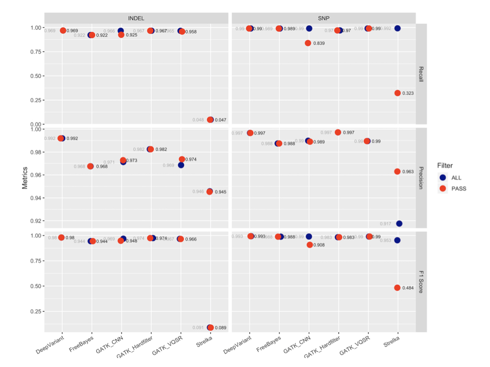

#  Germline_VariantCalling

__Writen by Chunlei Yu__
 

## Introduction

To identify clinical variants accurately and consistently, I have compared 6 germline variant calling pipelines. Each method was run according to the individual authors’ best-practice recommendations. Method information used in germline variant calling pipelines are shown table.1.

Table.1 Methods used in variant calling pipelines.

  <table style="width:60%"">
    <thead>
      <tr>
        <th>Method</th>
        <th>Version</th>
        <th>Algorithm</th>
        <th>References</th>
      </tr>
      <tr>
        <td>DeepVariant</td>
        <td>1.6</td>
        <td>Deep neural network</td>
        <td>Ryan Poplin, Pi-Chuan Chang. et al. (2018) A universal SNP and small-indel variant caller using deep neural networks. Nature Biotechnology, 36, 983–987. doi:10.1038/nbt.4235</td>
      </tr>
      <tr>
        <td>Genome Analysis Toolkit (GATK) HardFilter</td>
        <td>4.1.0.0</td>
        <td>Filter variant calls based on INFO and/or FORMAT annotations</td>
        <td>https://software.broadinstitute.org/gatk/</td>
      </tr>
      <tr>
        <td>Genome Analysis Toolkit (GATK) CNNScoreVariants</td>
        <td>4.1.2.0</td>
        <td>Convolutional Neural Network (CNN)</td>
        <td>https://software.broadinstitute.org/gatk/</td>
      </tr>
      <tr>
        <td>Genome Analysis Toolkit (GATK) CNNScoreVariants</td>
        <td>4.1.2.0</td>
        <td>Machine learning</td>
        <td>https://software.broadinstitute.org/gatk/</td>
      </tr>
      <tr>
        <td>FreeBayes</td>
        <td>1.1.0</td>
        <td>Bayesian genetic variant detector </td>
        <td>Erik Garrison, Gabor Marth. Haplotype-based variant detection from short-read sequencing. [arXiv:1207.3907] (http://arxiv.org/abs/1207.3907)</td>
      </tr>
      <tr>
        <td>Streka</td>
        <td>2.9.7</td>
        <td>Tiered haplotype-modeling strategy</td>
        <td>Kim, S., Scheffler, K. et al. (2018) Strelka2: fast and accurate calling of germline and somatic variants. Nature Methods, 15, 591-594. doi:10.1038/s41592-018-0051-x</td>
      </tr>      
    </thead>
    <tbody></tbody>
  </table>

 
To evaluate the sensitivity and precision for SNPs and InDels, the same dataset (Genome in a bottle truth dataset) and evaluation methodology (hap.py ) are applied to germline variant calling pipelines. The overall accuracy (F1, sort order within each variant type), recall, precision are shown over the whole genome .

Detailed informations can be checked in [Note_Germineline_VC_tools](Note_germline_VC_tools.pdf).
